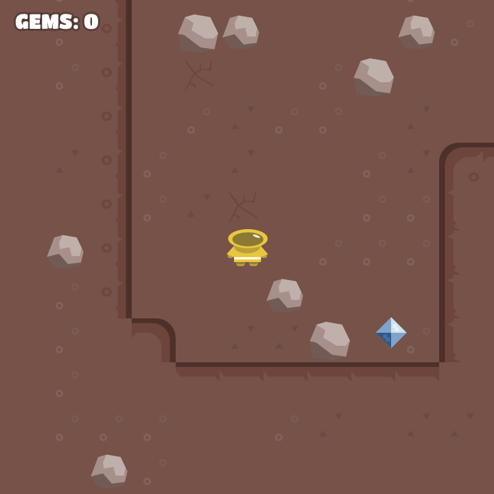
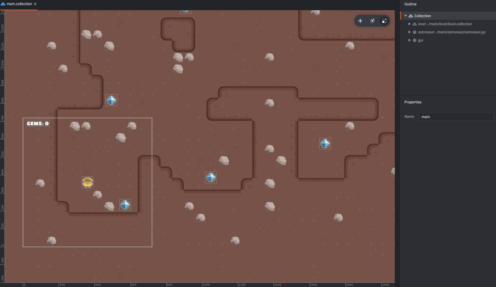
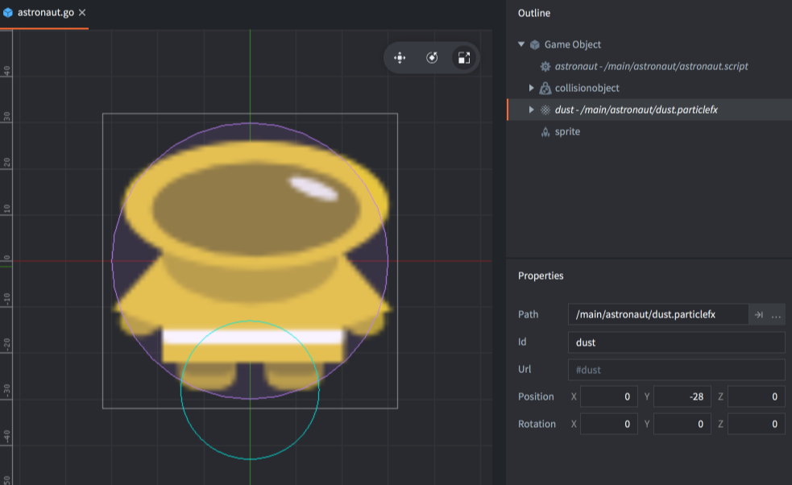
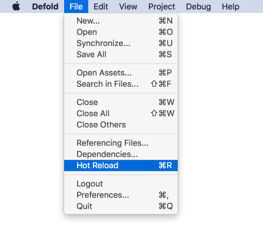
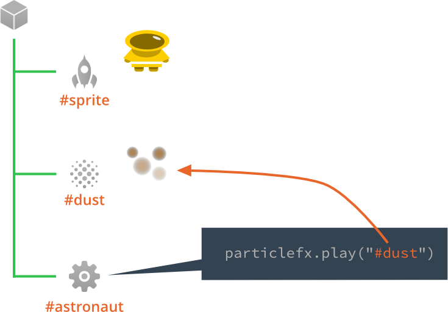

# Moony gems tutorial

In this beginner's tutorial you will learn how to create pickup objects, keep track of scoring and create a camera that follows the player character. Along the way you will get a thorough explanation of two central concepts in Defold: object addressing and message passing.

This tutorial project comes preset with all assets that you need. Start by [running the game](defold://build) (<kbd>Project ▸ Build</kbd>) to get a feel for what the tutorial contains. You control the astronaut character with the arrow keys.



Notice that while you cannot walk through rocks, nothing happens when you touch a gem. You are also able to walk out of the screen. If you open the file ["/main/main.collection"](defold://open?path=/main/main.collection) you see that the level is much larger than what fits on the screen:



## The dust trail particle effect

Before tackling these larger issues, let's warm up with a simple thing and add some dust trails when the astronaut walks the surface of this barren world. 

The astronaut game object is built in the file ["/main/astronaut/astronaut.go"](defold://open?path=/main/astronaut/astronaut.go). Open the file and see that there is a particle effect already built and added to the game object:



[Run the game again](defold://build) and while having the game still running, open the file ["/main/astronaut/astronaut.script"](defold://open?path=/main/astronaut/astronaut.script).

Scroll to the bottom of the file where you find the `on_reload()` function:

```
function on_reload(self)
    -- Add reload-handling code here
    -- Remove this function if not needed
end
```

The function is run each time you hot reload this script file into the running game. Change the function code so the following. This allows you to use hot reload to test the dust trail in the running game:

```
function on_reload(self)
    particlefx.play("#dust")
end
```

Now, with the script file still open, select <kbd>File ▸ Hot Reload</kbd> from the menu:



The editor now loads the new version of the file "astronaut.script" into the running engine and also calls the function `on_reload()` in that file. The result is that the dust particle effect is played once. Try reloading the file a few times to see that the particles show correctly, as a dust cloud around the feet of the astronaut.

## Addressing 

The line `particlefx.play("#dust")` calls the function `particlefx.play()` with an argument specifying the id of the particle effect that should play, in this case the component "dust" is specified.

Defold uses an URL based system for addressing components and game objects.




## Adding dust trails to walk animation

The game should play the particles automatically when walking.

Open ["/main/astronaut/astronaut.script"](defold://open?path=/main/astronaut/astronaut.script) and scroll down to the function `animate()`. Locate the line that says `if moving then` and edit the function so the code looks like this:

```
local moving = vmath.length_sqr(self.velocity) > 0.01
if moving then
    a = hash(f .. "-walk")

    -- dust particles
    if math.random() < 0.1 then                                 -- [1]
        particlefx.play("#dust")                                -- [2]
    end
end
```
1. This code is reached only when the astronaut is moving and playing a walk animation. Add a random interval so the effect is played every tenth frame on average.
2. Play the dust particle effect.

[Run the game again](defold://build) and try walking around. There should now be dust clouds forming around the feet of the astronaut.

## Adding a camera


Check out [the documentation pages](https://defold.com/learn) for examples, tutorials, manuals and API docs.

If you run into trouble, help is available in [our forum](https://forum.defold.com).

Happy Defolding!

---